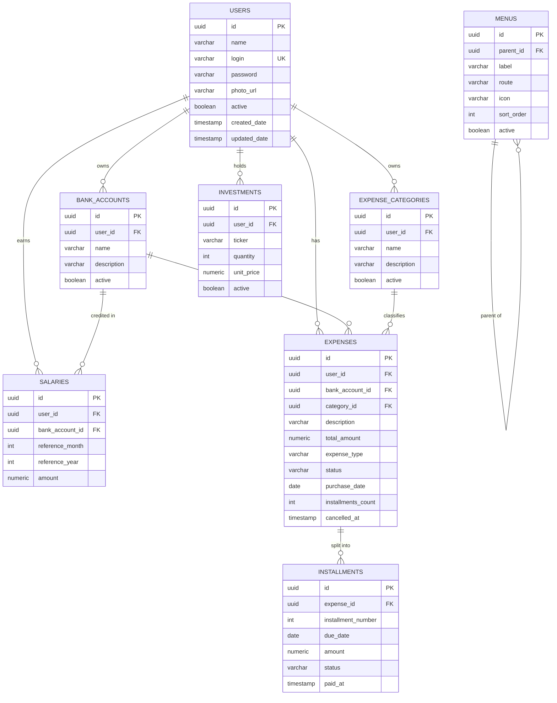

# Plano de Modelagem do Banco de Dados — Projeto `financial`

> **Status:** Draft v1 — aguardando revisão e aprovação do Diego.
> **Banco:** PostgreSQL 16+
> **Convenção:** sem migrations (Hibernate `ddl-auto=update`); tabelas serão geradas a partir das entidades JPA. Este documento é a **fonte de verdade do esquema**.

---

## 1. Decisões transversais (valem para todas as tabelas)

| Tema | Decisão | Por quê |
|------|---------|---------|
| Chave primária | `UUID` (gerada pela aplicação via `UUID.randomUUID()`) | Evita exposição de IDs sequenciais em rotas REST; facilita merge entre ambientes; padrão de mercado moderno. |
| Tipo monetário | `NUMERIC(12,2)` | Precisão exata para dinheiro (nunca `FLOAT`/`DOUBLE`). Suporta até R$ 9.999.999.999,99. |
| Timestamps | `TIMESTAMP WITH TIME ZONE` (UTC no banco) | Padrão Postgres recomendado. Conversão de fuso ocorre na camada de apresentação. |
| `created_date` / `updated_date` | Em **toda** tabela de domínio | Auditoria mínima; preenchido por listeners JPA (`@PrePersist`/`@PreUpdate`). |
| Soft-delete | Campo `active BOOLEAN` ou `status`/`cancelled_at` conforme a regra do domínio | Diego pediu explicitamente: registros cancelados nunca são apagados fisicamente. |
| Nomenclatura | `snake_case`, tabelas no **plural** (ex: `bank_accounts`) | Convenção amplamente adotada em Postgres. |
| Multi-usuário | Todas as tabelas de dados de domínio têm `user_id` (FK para `users`) | Mesmo que o uso inicial seja single-user, isola dados desde o começo — barato agora, caro depois. Exceção: `menus` (globais para todos os usuários). |
| Auth/senha | Coluna `password` armazena **BCrypt hash** (60 chars, mas `VARCHAR(100)` por margem) | BCrypt já é resistente a rainbow tables e tem custo configurável. |

---

## 2. Visão geral — Diagrama ER



---

## 3. Tabelas — detalhamento

### 3.1 `users`
**Propósito:** Quem pode fazer login no sistema. Cadastro é manual (não há tela de signup nesta versão).

| Coluna | Tipo | Constraints | Observação |
|--------|------|-------------|------------|
| `id` | UUID | PK | Gerado pela aplicação. |
| `name` | VARCHAR(120) | NOT NULL | Nome de exibição (ex: "Diego Santos"). |
| `login` | VARCHAR(60) | NOT NULL, UNIQUE | Identificador de login (ex: "diego"). |
| `password` | VARCHAR(100) | NOT NULL | Hash BCrypt. **Nunca trafegado em respostas da API.** |
| `photo_url` | VARCHAR(500) | NULL | URL da foto. Upload real fica para spec futura — por ora, só URL. |
| `active` | BOOLEAN | NOT NULL DEFAULT TRUE | Usuários desativados não conseguem logar. |
| `created_date` | TIMESTAMPTZ | NOT NULL DEFAULT NOW() | |
| `updated_date` | TIMESTAMPTZ | NOT NULL DEFAULT NOW() | |

---

### 3.2 `bank_accounts`
**Propósito:** Contas bancárias onde o salário é creditado e de onde as despesas saem (ex: Nubank, Itaú).

| Coluna | Tipo | Constraints | Observação |
|--------|------|-------------|------------|
| `id` | UUID | PK | |
| `user_id` | UUID | NOT NULL, FK → `users.id` | |
| `name` | VARCHAR(80) | NOT NULL | Ex: "Nubank". |
| `description` | VARCHAR(255) | NULL | Texto livre (agência/número se quiser, ou só nota). |
| `active` | BOOLEAN | NOT NULL DEFAULT TRUE | Soft-delete. |
| `created_date` | TIMESTAMPTZ | NOT NULL DEFAULT NOW() | |
| `updated_date` | TIMESTAMPTZ | NOT NULL DEFAULT NOW() | |

**Índice:** `(user_id, active)` para listagens rápidas.

---

### 3.3 `expense_categories`
**Propósito:** Categorias para classificar despesas (ex: Alimentação, Moradia, Transporte). Usado também para alimentar o gráfico de pizza no dashboard.

| Coluna | Tipo | Constraints | Observação |
|--------|------|-------------|------------|
| `id` | UUID | PK | |
| `user_id` | UUID | NOT NULL, FK → `users.id` | |
| `name` | VARCHAR(80) | NOT NULL | |
| `description` | VARCHAR(255) | NULL | |
| `active` | BOOLEAN | NOT NULL DEFAULT TRUE | |
| `created_date` | TIMESTAMPTZ | NOT NULL DEFAULT NOW() | |
| `updated_date` | TIMESTAMPTZ | NOT NULL DEFAULT NOW() | |

**Constraint:** `UNIQUE (user_id, name)` — o mesmo usuário não pode ter duas categorias com nome idêntico.

---

### 3.4 `salaries`
**Propósito:** Salário **por competência (mês/ano)** atrelado a uma conta bancária. Permite histórico mensal correto para o dashboard.

| Coluna | Tipo | Constraints | Observação |
|--------|------|-------------|------------|
| `id` | UUID | PK | |
| `user_id` | UUID | NOT NULL, FK → `users.id` | |
| `bank_account_id` | UUID | NOT NULL, FK → `bank_accounts.id` | Em qual conta o salário foi creditado. |
| `reference_month` | INTEGER | NOT NULL, CHECK (1..12) | |
| `reference_year` | INTEGER | NOT NULL, CHECK (>= 2000) | |
| `amount` | NUMERIC(12,2) | NOT NULL, CHECK (>= 0) | |
| `description` | VARCHAR(255) | NULL | Ex: "Salário CLT + bônus". |
| `created_date` | TIMESTAMPTZ | NOT NULL DEFAULT NOW() | |
| `updated_date` | TIMESTAMPTZ | NOT NULL DEFAULT NOW() | |

**Constraint:** `UNIQUE (user_id, reference_year, reference_month)` — 1 salário por competência por usuário (escopo desta versão, conforme decisão).

> **Justificativa do modelo:** se o salário fosse "valor fixo único", o dashboard de um mês passado mostraria o salário atual (incorreto). Por competência, o histórico é preservado e o cálculo do saldo respeita a realidade de cada mês.

---

### 3.5 `expenses`
**Propósito:** Despesa cadastrada. Pode ser **fixa** (recorrente todo mês, ex: Netflix) ou **parcelada** (compra parcelada em N vezes, ex: geladeira em 10x).

| Coluna | Tipo | Constraints | Observação |
|--------|------|-------------|------------|
| `id` | UUID | PK | |
| `user_id` | UUID | NOT NULL, FK → `users.id` | |
| `bank_account_id` | UUID | NOT NULL, FK → `bank_accounts.id` | Conta que paga essa despesa. |
| `category_id` | UUID | NOT NULL, FK → `expense_categories.id` | |
| `description` | VARCHAR(200) | NOT NULL | Ex: "Netflix" ou "Geladeira Brastemp". |
| `total_amount` | NUMERIC(12,2) | NOT NULL, CHECK (>= 0) | Para FIXED: valor mensal. Para INSTALLMENT: valor total da compra. |
| `expense_type` | VARCHAR(20) | NOT NULL, CHECK IN ('FIXED','INSTALLMENT') | |
| `status` | VARCHAR(20) | NOT NULL DEFAULT 'ACTIVE', CHECK IN ('ACTIVE','CANCELLED') | |
| `purchase_date` | DATE | NOT NULL | Data da compra (para FIXED: data de início da recorrência). |
| `installments_count` | INTEGER | NULL, CHECK (>= 1) | Preenchido **somente** quando `expense_type='INSTALLMENT'`. |
| `cancelled_at` | TIMESTAMPTZ | NULL | Preenchido quando `status='CANCELLED'`. |
| `created_date` | TIMESTAMPTZ | NOT NULL DEFAULT NOW() | |
| `updated_date` | TIMESTAMPTZ | NOT NULL DEFAULT NOW() | |

**Regras de integridade (aplicação valida; banco protege com CHECK):**
- Se `expense_type='INSTALLMENT'`, então `installments_count IS NOT NULL` e `installments_count >= 1`.
- Se `expense_type='FIXED'`, então `installments_count IS NULL`.
- Se `status='CANCELLED'`, então `cancelled_at IS NOT NULL`.

**Índices:** `(user_id, status)`, `(user_id, category_id)`, `(user_id, purchase_date)`.

> **Por que separar `expenses` de `installments`?** Para que uma compra parcelada de R$ 1.000 em 10x desconte **R$ 100 no mês corrente**, não R$ 1.000. As parcelas individuais vivem na tabela `installments` e o dashboard agrega por mês de vencimento.

---

### 3.6 `installments`
**Propósito:** Parcelas individuais de uma `expense` do tipo `INSTALLMENT`. Permite controle granular: cada parcela tem seu próprio vencimento e status (paga, pendente, cancelada, antecipada).

| Coluna | Tipo | Constraints | Observação |
|--------|------|-------------|------------|
| `id` | UUID | PK | |
| `expense_id` | UUID | NOT NULL, FK → `expenses.id` ON DELETE CASCADE | Cascata só para integridade — em uso normal nada é apagado, é cancelado. |
| `installment_number` | INTEGER | NOT NULL, CHECK (>= 1) | 1, 2, 3, ..., N. |
| `due_date` | DATE | NOT NULL | Mês/ano em que a parcela conta no dashboard. |
| `amount` | NUMERIC(12,2) | NOT NULL, CHECK (>= 0) | `total_amount / installments_count` no momento da criação. |
| `status` | VARCHAR(20) | NOT NULL DEFAULT 'PENDING', CHECK IN ('PENDING','PAID','CANCELLED','ANTICIPATED') | |
| `paid_at` | TIMESTAMPTZ | NULL | Preenchido quando `status='PAID'` ou `'ANTICIPATED'`. |
| `created_date` | TIMESTAMPTZ | NOT NULL DEFAULT NOW() | |
| `updated_date` | TIMESTAMPTZ | NOT NULL DEFAULT NOW() | |

**Constraint:** `UNIQUE (expense_id, installment_number)`.

**Geração das parcelas:** quando uma despesa `INSTALLMENT` é criada, a aplicação cria automaticamente as N linhas em `installments`, com `due_date` espaçado mensalmente a partir de `purchase_date`.

**Cancelamento da despesa parcelada:** marca `expenses.status='CANCELLED'` E marca as parcelas com `status='PENDING'` como `'CANCELLED'`. Parcelas já pagas ficam intactas.

**Adiantamento de parcela:** funcionalidade fica para spec separada — por ora, a tabela suporta com `status='ANTICIPATED'` e `paid_at` preenchido.

---

### 3.7 `investments`
**Propósito:** Carteira de investimentos do usuário (ações, FIIs, etc.). Modelagem por **posição atual**, não por histórico de aportes.

| Coluna | Tipo | Constraints | Observação |
|--------|------|-------------|------------|
| `id` | UUID | PK | |
| `user_id` | UUID | NOT NULL, FK → `users.id` | |
| `ticker` | VARCHAR(20) | NOT NULL | Ex: "MXRF11". |
| `quantity` | INTEGER | NOT NULL, CHECK (>= 0) | Quantidade de cotas. |
| `unit_price` | NUMERIC(12,2) | NOT NULL, CHECK (>= 0) | Valor por cota informado manualmente. |
| `description` | VARCHAR(255) | NULL | |
| `active` | BOOLEAN | NOT NULL DEFAULT TRUE | Soft-delete (ex: vendeu a posição). |
| `created_date` | TIMESTAMPTZ | NOT NULL DEFAULT NOW() | |
| `updated_date` | TIMESTAMPTZ | NOT NULL DEFAULT NOW() | |

**Constraint:** `UNIQUE (user_id, ticker)` enquanto `active=TRUE` (uma posição ativa por ticker; reabrir após venda gera nova linha).

> **Decisão simplificada:** sem integração com API de cotação. `unit_price` é informado pelo usuário e atualizado manualmente. Versão futura pode plugar uma fonte de preços.

---

### 3.8 `menus`
**Propósito:** Itens do menu lateral do front, cadastrados em banco. Suporta hierarquia (submenus) via auto-referência.

| Coluna | Tipo | Constraints | Observação |
|--------|------|-------------|------------|
| `id` | UUID | PK | |
| `parent_id` | UUID | NULL, FK → `menus.id` | NULL = item raiz. |
| `label` | VARCHAR(80) | NOT NULL | Texto exibido (ex: "Despesas"). |
| `route` | VARCHAR(120) | NULL | Rota do front (ex: "/expenses"). NULL para itens pai sem rota direta. |
| `icon` | VARCHAR(60) | NULL | Nome do ícone (ex: "wallet"). Convenção a definir com biblioteca do front. |
| `sort_order` | INTEGER | NOT NULL DEFAULT 0 | Ordem de exibição entre irmãos. |
| `active` | BOOLEAN | NOT NULL DEFAULT TRUE | Desativar sem apagar. |
| `created_date` | TIMESTAMPTZ | NOT NULL DEFAULT NOW() | |
| `updated_date` | TIMESTAMPTZ | NOT NULL DEFAULT NOW() | |

**Observação:** menus são **globais** (não têm `user_id`). Todos os usuários enxergam os mesmos itens.

> **Confirmação (2026-05-31):** tabela `menus` permanece no schema. População via `data.sql` no startup, sem CRUD administrativo nesta versão. Diego ativa/desativa itens via UPDATE direto no banco. Front consome via `GET /api/menus` (apenas `active=true`, ordenado por `sort_order`).

---

## 4. Como o dashboard calcula o saldo do mês

Para a competência **MM/AAAA** do usuário logado:

```
saldo_do_mes =
    (salário do mês MM/AAAA)
  - (Σ expenses FIXED ACTIVE com purchase_date <= último dia do mês)
  - (Σ installments com due_date no mês MM/AAAA, status IN ('PENDING','PAID','ANTICIPATED'))
```

Parcelas com `status='CANCELLED'` não entram. Despesas com `status='CANCELLED'` e suas parcelas pendentes também não entram (cascata na regra de cancelamento).

**Gráfico de pizza:** agrega `total_amount` (para FIXED) e `amount` da parcela (para INSTALLMENT do mês) por `category_id`, retornando `{category_name, total}` para o front renderizar.

---

## 5. Decisões resolvidas (2026-05-31)

Todos os pontos abertos da primeira versão deste documento foram fechados em conjunto com o plano de desenvolvimento. Resumo:

1. **Menus em banco.** ✅ Tabela mantida; população via `data.sql`; sem CRUD admin.
2. **Multi-user.** ✅ `user_id` mantido em todas as tabelas de domínio.
3. **`Investment.quantity`.** ✅ `INTEGER`.
4. **Adiantar parcela.** ✅ Spec separada pós WORK-06 (estrutura de dados já preparada com `status='ANTICIPATED'`).
5. **Foto do usuário.** ✅ Upload real para **MinIO** (S3-compatible). `photo_url` armazena URL/caminho do objeto. Adicionado signup público (REQ-12 / WORK-11).

Detalhamento completo das decisões em `02-development-plan.md` §13.

---

## 6. Próximo passo

Este documento está aprovado e congelado. As próximas ações estão sequenciadas em `02-development-plan.md` (WORK-01 a WORK-11). Cada WORK vira uma spec própria antes de virar código.
